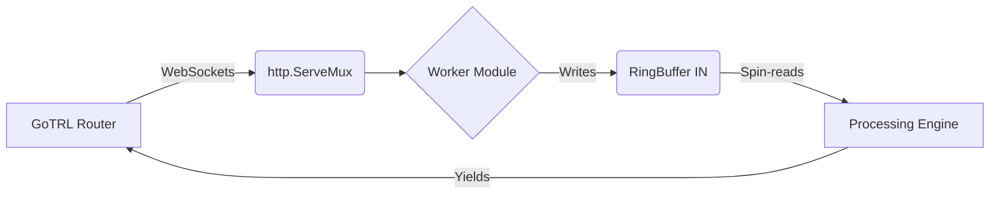

# 🌉 Bridge-TRL

<p align="center">
  <a href="https://go.dev"></a>
  
  
  <a href="https://opensource.org/licenses/MIT"></a>
</p>

**Bridge-TRL** is a comprehensive, all-in-one Dockerized backend providing streaming capabilities for Translation, Speech-to-Text (STT), Text-to-Speech (TTS), Image-to-Text (ITT), and Text Inflection. 

It was specifically designed for GoTRL. While GoTRL acts as the router handling data distribution to workers, Bridge-TRL serves as the ultimate example of how to build high-performance, WebSocket-based endpoints that GoTRL can interact with.
## ✨ Key Features

  * **GoTRL Ready**: Built natively to seamlessly integrate with GoTRL.
  * **All-in-One Toolkit**: Consolidates 5 powerful tools (STT, TTS, ITT, Translate, Inflector) into a single unified service.
  * **Lock-Free Streaming**: Used a custom atomic ring buffer for the hotpath, ensuring zero-allocation memory reads/writes and ultra-low latency during real-time WebSocket communication.
  * **EasyTranslate Inside**: The translation module is fully powered by my lightweight, memory-optimized `EasyTranslate` library, handling context-aware text transformations locally.
  * **Flexible AI Backends**: Supports local offline models (Vosk, RHVoice, Ollama) as well as external HTTP APIs or bash scripts to process data.

## 🐳 Deployment (Docker)

Bridge-TRL provides two deployment strategies depending on your network constraints and available offline models.

### Option 1: Local / Offline Build (Tested & Recommended)
Use this option if you face network restrictions (e.g., `alphacep` servers being blocked) or prefer using pre-downloaded models. It utilizes local instances of `rhvoice` and `vosk`. 

Make sure your models are placed in the `./assets/` directory before building.

```bash
docker build -t bridge-trl -f Dockerfile .
docker run --network host bridge-trl
```

### Option 2: Full Standalone Build

This Dockerfile attempts to download all necessary dependencies and models (including Vosk) automatically during the build process.

> ⚠️ **Warning:** I have not fully tested this build. If your network blocks `alphacep` servers, Docker will fail to download the models and timeout. Use Option 1 if you encounter this issue.

```bash
docker build -t bridge-trl -f Dockerfile.full .
docker run --network host bridge-trl
```

## 🏗 Architecture & Custom Workers

Bridge-TRL isolates every processing unit into a modular interface. If you want to write your own worker, you just need to implement this simple interface:

```go
package workers

import "net/http"

type Worker interface {
    GetName() string
    Register(m *http.ServeMux)
}

```

### Data Flow



## 📖 Endpoints Reference 

All endpoints operate over WebSockets (`ws://`) to support continuous data streaming.

* **`/stt` (Speech-to-Text)**: Powered by **Vosk**. Streams PCM audio bytes and returns recognized text. Handles partial string trimming automatically.
* **`/translate` (Translator)**: Powered by **EasyTranslate**. Accepts a setup message (e.g., `en ru`) or uses auto-detection, then translates text streams on the fly using local `key:value` dictionaries.
* **`/tts` (Text-to-Speech)**: Powered by **RHVoice**. Converts text chunks into audio bytes. Supports fallback to external APIs or local bash scripts depending on your configuration.
* **`/itt` (Image-to-Text)**: Powered by `gosseract` (Tesseract OCR). Accepts image bytes over WS and returns the extracted text string.
* **`/inflector` (Inflector)**: Intelligent grammar corrector. Useful for adjusting grammatical agreement (word forms, gender, cases) of translated text against the original context using AI models (like Ollama).

## 📜 Licenses

This project includes and links against several open-source libraries. To ensure full legal compliance when copying, modifying, or distributing **Bridge-TRL**, here is a breakdown of what license applies to each module, what it is used for, and where to find its original terms.

| Dependency / Module | License | Used For | Reference Link |
| :--- | :--- | :--- | :--- |
| **Vosk API** | Apache-2.0 | Core backend for the Speech-to-Text (`/stt`) worker. Handles PCM audio stream recognition. | [alphacep/vosk-api](https://github.com/alphacep/vosk-api) |
| **EasyTranslate** | MIT | Lightweight, memory-optimized text translation backend used by the `/translate` worker. | [Votline/EasyTranslate](https://github.com/Votline/EasyTranslate) |
| **Go-Audio** | MIT | Record, play, and handles low-level manipulation of audio byte streams. | [Votline/Go-audio](https://github.com/Votline/Go-audio) |
| **Gorilla WebSocket** | BSD-2-Clause | Provides full-duplex streaming capabilities across all API endpoints (`/stt`, `/tts`, etc.). | [gorilla/websocket](https://github.com/gorilla/websocket) |
| **Gosseract** | MIT | Go wrapper around the Tesseract OCR engine, running inside the Image-to-Text (`/itt`) worker. | [otiai10/gosseract](https://github.com/otiai10/gosseract) |
| **Zap** | MIT | High-performance, structured, and leveled logging package applied globally in the router. | [uber-go/zap](https://github.com/uber-go/zap) |

  - **License:** This project is licensed under [MIT](LICENSE)
  - **Third-party Licenses:** Third-party [licenses/](licenses/).

